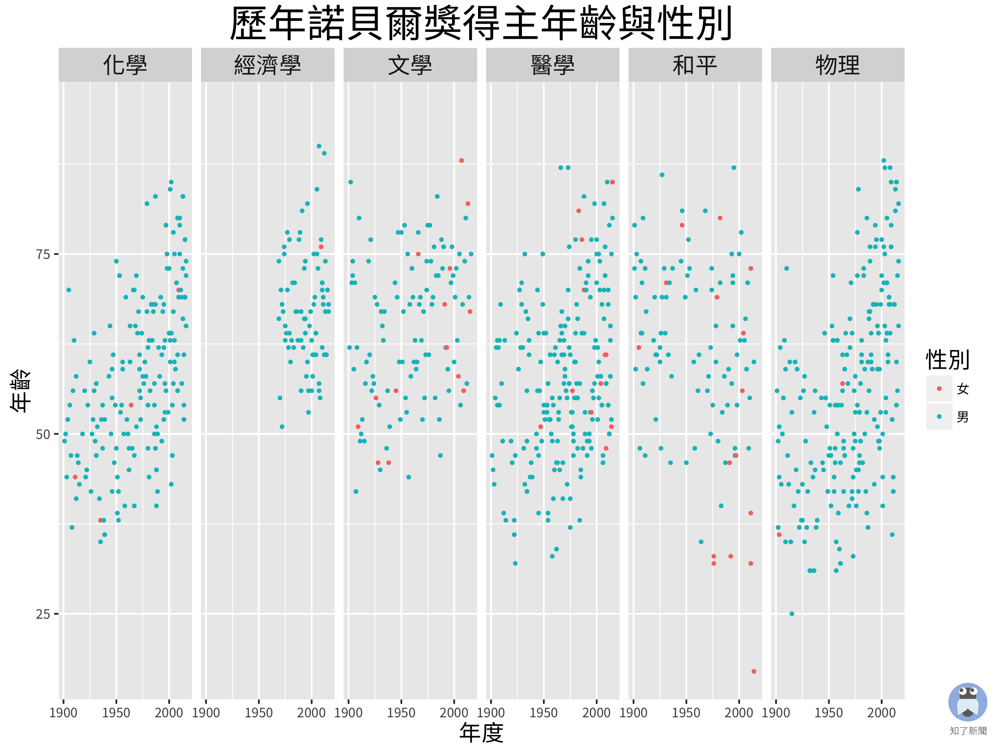
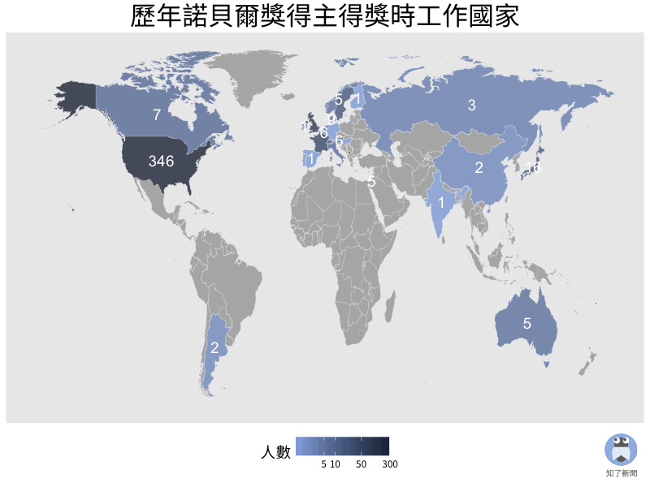

# 諾貝爾歷屆得主視覺化
這是[知了新聞](https://www.facebook.com/Cicadatatw/)製作的諾貝爾獎歷屆得主視覺化的原始碼跟簡單說明。

你可以下載資料集 `laureate.csv` 回去自己玩，或是下載 `nobel.R` 這支 R Script 回去重現 missmoss 所作的圖。
## 資料集介紹
#### 資料來源：[諾貝爾獎官方網站](https://www.nobelprize.org/)
#### 資料欄位：

| 欄位名稱    | 資料型態           | 描述  |
| ------------- |:-------------:| -----:|
| id      | 數字 | 得主的「座號」，同一個人拿兩次也會拿到同一個座號喔 |
| firstname     | 文字      |  得主的名字 |
| surname | 文字   | 得主的姓氏|
| born | 日期      |    得主的出生年月日 |
| died | 日期      |  得主逝世年月日（如果得主已經過世才會有值） |
| bornCountry | 文字     | 得主出生的國家 |
| bornCountryCode | 文字      |  得主出生的國家兩字縮寫 |
| bornCity | 文字     |    得主出生的城市 |
| diedCountry | 文字 |得主過世的國家 |
| diedCountryCode | 文字  |    得主過世的國家兩字縮寫 |
|diedCity|文字|得主過世的城市|
|gender|文字|得主的性別|
|year|日期（年）|得獎年份|
|category|文字|得獎類別|
|overallMotivation|文字|得獎原因（群體／組織）|
|share|數字|本次總共幾個人分享這個類別的諾貝爾獎|
|motivation|文字|得獎原因（個人）|
|name|文字|任職的公司／單位／組織名稱|
|city|文字|任職的公司／單位／組織所在城市|
|country|文字|任職的公司／單位／組織所在國家|

細心的讀者可能會發現，同一個 ID 的得主可能會在資料裡面出現兩次以上，這有可能是因為得主得了兩次獎（例如瑪麗．居里拿過 1903 年的物理獎及 1910 年的化學獎），或是得主同時任職於兩個單位之類的原因。

### R Script (nobel.R) 使用方式

在 RStudio 左上角的 script/dataset 區塊按下 `開啟舊檔` 的按鈕，然後把你下載的 R Script 打開。接著按 `Source` ，RStudio 就會幫你把整支 Script 跑完。如果有修改檔案內容的話，要先存檔才能 `Source` 喔。

![RStudio 怎麼開原始碼] (img/rstudio.png)

如果好奇每個指令會發生什麼事，可以使用 `Run`，`Run` 只會幫你執行游標所在的那一行。

## Step by Step 製作歷年諾貝爾獎得主視覺化
### 整理資料

首先，把我們需要的整理資料的套件 `dplyr` 跟畫圖套件 `ggplot2` 讀進來：

    library("dplyr")
    library(“ggplot2”)

把資料讀進來：

    ll <- read.csv("~/laureate.csv", stringsAsFactors=FALSE)

用 `str` 看一下欄位：

    str(ll)

發現日期欄位被讀成了字串，先來把他們轉成日期：

    ll$born <- as.Date(ll$born , "%Y-%m-%d")
    ll$died <- as.Date(ll$died , "%Y-%m-%d")

目前資料集裡只有生卒年跟得獎年份，用 `mutate` 在 data.frame 加一個欄位 `age` ，來計算一下各個得主得獎的年紀放進 `age`：

    ll <- mutate(ll, age = year - as.numeric(format(born,”%Y”)))

接著就可以來畫圖囉，先把我們要畫圖的欄位拿出來另外存成一個 data.frame：

    lldraw <- select(ll, year, age, category, gender)

接著把沒有值的欄位丟掉：

    lldraw <- na.omit(lldraw)

因為資料是英文的，為了等等畫圖之後方便顯示中文，先來把 `category` 跟 `gender` 變成 `factor`，然後改成中文：

    lldraw$category <- as.factor(lldraw$category)
    # levels(lldraw$category)
    # [1] "chemistry"  "economics"  "literature" "medicine"   "peace"   "physics" 
    levels(lldraw$category) <- c("化學", "經濟學", "文學", "醫學", "和平", "物理")
    lldraw$gender <- as.factor(lldraw$gender)
    # levels(lldraw$gender)
    # [1] "female" "male"  
    levels(lldraw$gender) <- c("女", "男")
    
繼續進行偷吃步的動作，新增一個 `性別` 欄位 XD

    lldraw <- mutate(lldraw, 性別=gender)

### 使用 ggplot2 繪圖

好惹！準備工作完成，來畫圖吧！

    g <- ggplot(data=lldraw, aes(x=year, y=age)) + 
         geom_point(size=0.7, aes(colour=性別)) +
         facet_grid(. ~ category) +
         scale_x_continuous("年度", breaks=c(1900, 1950, 2000)) +
         scale_y_continuous("年齡", limit=c(17,95)) +
         ggtitle("歷年諾貝爾獎得主年齡與性別") + 
         theme(text=element_text(family="Noto Sans CJK TC", size=10), 
               title=element_text(size=20),
               axis.title=element_text(size=14),
               legend.title=element_text(size=14),
               strip.text=element_text(size=14))

等等，上面那一串是做什麼的 =口=
下面就一行一行來解釋吧！

先把畫布畫出來

    ggplot(data=lldraw, aes(x=year, y=age))

畫上點，並依照性別填上不同顏色，點的大小是 0.7

    geom_point(size=0.7, aes(colour=性別))

依照得獎類別分開畫圖

    facet_grid(. ~ category)

設定 x 軸，第一格是 x 軸標題，`breaks` 則是軸上標記座標點的位置

    scale_x_continuous("年度", breaks=c(1900, 1950, 2000))

設定 y 軸，第一格式 y 軸標題，`limit` 則是 y 軸上顯示的範圍，或可說是最小值跟最大值

    scale_y_continuous("年齡", limit=c(17,95))

加上標題

    ggtitle("歷年諾貝爾獎得主年齡與性別")

因為使用中文，加上要作圖放在 facebook 上，為求比較好的呈現效果，調整了一下字型跟字體大小
由於 ggplot2 預設使用英文字型，因此如果輸入中文可能會顯示不出來
所以在圖中使用中文文字的話記得要調整成有中文字的字體喔。
第一行是把所有的字型設定成思源黑體，字體大小是 10
第二行把所有標題字體大小設定成 20 
第三、四、五行把座標軸、圖例和分類圖區塊標題的字體大小都設定成 14

    theme(text=element_text(family="Noto Sans CJK TC", size=10), 
          title=element_text(size=20),
          axis.title=element_text(size=14),
          legend.title=element_text(size=14),
          strip.text=element_text(size=14))

最後只要呼喚 g 把圖叫出來：

    g

或者是使用 `ggsave` 把畫好的圖存檔：

    ggsave("nobel.png")

畫完了！收工！開心～～～～

成品應該會類似這樣：

## 歷年諾貝爾獎得主得獎時工作國家視覺化
### 準備地圖
雖然諾貝爾獎官網非常貼心，已經將適合作業的 `country code` 直接放在資料裡，但即使要使用 `country code` 直接畫圖，我們還是需要借助一些地理資訊的套件，來獲取經緯度資料，才能繪製地圖。

畫圖之前，要請大家先到 [thematicmapping.org](http://thematicmapping.org/) 下載 `TM_WORLD_BORDERS-0.3.zip` 、解壓縮，放在你的 R 預設資料夾下面。

打開 R，載入相關的套件

    library("rworldmap")
    library("countrycode")
    library("rgdal")

接著開始準備地圖資料。`"world"` 是 `map_data` 裡面的一個資料集，裡面包含了世界各國邊界的經緯度資料。

    world <- map_data("world")
    
因為我們不需要南極洲，所以可以先跟他說掰掰

    world <- world[world$region != "Antarctica",]
    
諾貝爾獎資料集裡面的國家代碼 `country code` 是兩碼，所以我們先把 `world` 裡面的國家資料加上 `iso2c` 也就是兩碼縮寫的欄位。
    
    world <- mutate(world, iso2c=countrycode(world$region, "country.name", "iso2c"))
    
然後開始準備我們想畫的資料。這裡我同時做了出生國家和工作國家，但因為出生國家 BBC 已經做過了，所以就後面只嘗試畫了工作國家。大家看懂之後可以自己嘗試畫畫看出生國家地圖喔。

使用了 `dplyr` 套件的 `summarise` 功能，其中的 `group_by` 函數來將各個國家的人數加總。接著將出生跟工作國家兩個數字合併。

    bornCount <- summarise(group_by(ll, bornCountryCode), bornNumber=n_distinct(id))
    orgCount <- summarise(group_by(ll, country), orgNumber=n_distinct(id))
    orgCount <- mutate(orgCount, iso2c=countrycode(orgCount$country, "country.name", "iso2c"))
    countryCount <- merge(bornCount, orgCount, by.x="bornCountryCode", by.y="iso2c", all=TRUE)
    
最後再把我們的資料跟前面做好的地圖資料合併。

    world2 <- merge(world, countryCount, by.x="iso2c", by.y="bornCountryCode", all.x=TRUE)
    
因為想在地圖上直接顯示各國人數，但前面的資料只處理了國家邊界。所以接下來我們要來做一組「每個國家的中心」加上「得獎人數」的資料。

    worldMap <- readOGR(dsn="world_borders", layer="TM_WORLD_BORDERS_SIMPL-0.3")
    worldMap.fort <- fortify(world2, region = "ISO2")
    idList <- worldMap@data$ISO2
    centroids.df <- as.data.frame(coordinates(worldMap))
    names(centroids.df) <- c("Longitude", "Latitude") 
    centroid <- cbind(idList, centroids.df)
    orgNumGeo <- merge(centroid, countryCount, by.x="idList", by.y="bornCountryCode")
    
好喔，資料處理完可以來畫圖惹！

首先我們一樣先把完整的 code 貼出來

    gg <- ggplot(data=world2) + 
          geom_map(data=world2, map=world,
                   aes(x=long, y=lat, map_id=region, fill=orgNumber), 
                   color="white", size=0.05, alpha=0.8) + 
          geom_text(data=orgNumGeo, 
                    aes(x=Longitude, y=Latitude, label=orgNumber, map_id=country), 
                    na.rm=TRUE, colour="white", size=5, check_overlap = TRUE) +
          scale_x_continuous(NULL, breaks=NULL) +
          scale_y_continuous(NULL, breaks=NULL) +
          ggtitle("歷年諾貝爾獎得主得獎時工作國家") + 
          scale_fill_continuous("人數", low = "#8FAADC", 
                                high = "#222E43", trans = "log", 
                                breaks=c(0, 5, 10, 50, 300), na.value = "grey65") + 
          theme(text=element_text(family="Noto Sans CJK TC"), 
                title=element_text(size=20),
                legend.title=element_text(size=14),
                legend.position = "bottom")
        
接著一行一行來看吧

首先開畫布，跟他說我們的資料是 `world2`

    ggplot(data=world2)

然後說我們要畫地圖！指定 `x` 是緯度、`y` 是經度。填色則依照各國家工作的人數。`color` 是指國家邊界的顏色， `size` 是邊界的寬度，`alpha` 則是填色的參數，越低的話顏色看起來越淡。

    geom_map(data=world2, map=world,
             aes(x=long, y=lat, map_id=region, fill=orgNumber), 
             color="white", size=0.05, alpha=0.8)
             
接著使用 `geom_text` 在各國加上數字

    geom_text(data=orgNumGeo, 
              aes(x=Longitude, y=Latitude, label=orgNumber, map_id=country), 
              na.rm=TRUE, colour="white", size=5, check_overlap = TRUE)
              
經緯度在本次繪圖中扮演著默默付出的角色，圖上好像不需要這些資訊，所以來把經緯度座標軸跟數字都設成 `NULL`

    scale_x_continuous(NULL, breaks=NULL)
    scale_y_continuous(NULL, breaks=NULL)
    
加上標題

    ggtitle("歷年諾貝爾獎得主得獎時工作國家") 
    
再調整一下地圖的填色，因為美國跟後面差距實在太大啦，把填色的邏輯改成 `log`，然後把 `breaks` 設成比較適合對照的數字。

    scale_fill_continuous("人數", low = "#8FAADC", high = "#222E43", trans = "log", breaks=c(0, 5, 10, 50, 300), na.value = "grey65") + 

最後別忘了調整成中文字體

    theme(text=element_text(family="Noto Sans CJK TC"), 
          title=element_text(size=20),
          legend.title=element_text(size=14),
          legend.position = "bottom")
          
大功告成！存檔去～

    ggsave("nobel_map.png")

成品可能會長得像這樣：
  

    
### 結語

讀到這裡，想必你已經成功畫出兩張跟[知了新聞](https://www.facebook.com/Cicadatatw/)粉絲頁上一模一樣的圖了。這次的諾貝爾獎資料集，還有很多欄位沒有使用到，就等你去探索啦～畫出有趣的圖也請不吝跟我們分享喔！
